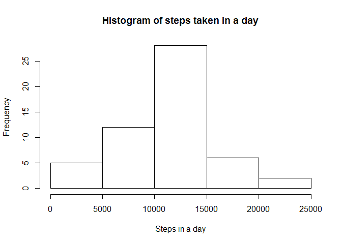
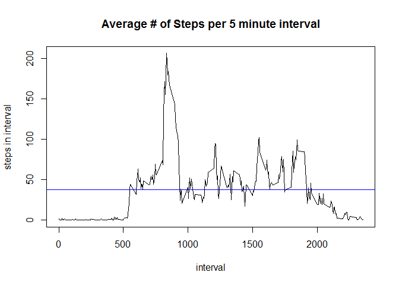
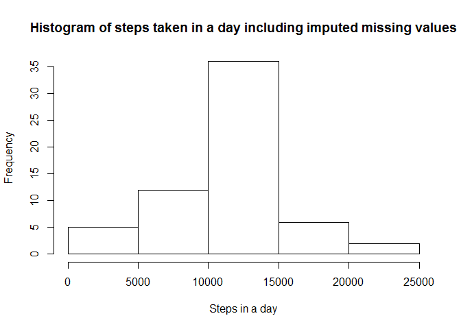
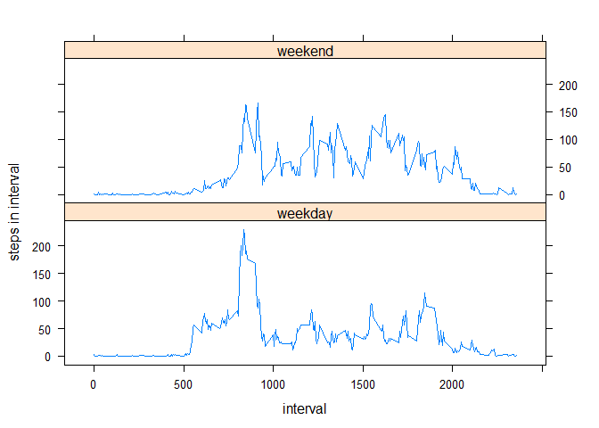

# Reproducible Research: Peer Assessment 1

##Summary
This research analysis Activity monitoring data that consists of the number of steps taken in 5-minute intervals with the date and interval identifier of the measurement.

##Table of contents
- Loading and preprocessing the data
- Questions
  1. What is mean total number of steps taken per day?
  2. What is the average daily activity pattern?
  3. Imputing missing values
  4. Are there differences in activity patterns between weekdays and weekends?
- SessionInfo


## Loading and preprocessing the data
First load the data into a table called 'data'

```r
data <- read.table(unz("activity.zip", "activity.csv"), header=T, sep=",")
```
Then browse the data's structure and preview the first set of rows.

```r
str(data)
```

```
## 'data.frame':	17568 obs. of  3 variables:
##  $ steps   : int  NA NA NA NA NA NA NA NA NA NA ...
##  $ date    : Factor w/ 61 levels "2012-10-01","2012-10-02",..: 1 1 1 1 1 1 1 1 1 1 ...
##  $ interval: int  0 5 10 15 20 25 30 35 40 45 ...
```

```r
head(data)
```

```
##   steps       date interval
## 1    NA 2012-10-01        0
## 2    NA 2012-10-01        5
## 3    NA 2012-10-01       10
## 4    NA 2012-10-01       15
## 5    NA 2012-10-01       20
## 6    NA 2012-10-01       25
```

```r
library(dplyr)
```

```
## 
## Attaching package: 'dplyr'
## 
## The following object is masked from 'package:stats':
## 
##     filter
## 
## The following objects are masked from 'package:base':
## 
##     intersect, setdiff, setequal, union
```

```r
data <- mutate(data,
    datetime = 
        paste(date, 
            paste(sprintf("%02d",floor(interval/100)), #hour
                sprintf("%02d",interval %% 100),        #minute
                "00", sep=":"
            )
        )
    )

head(data)
```

```
##   steps       date interval            datetime
## 1    NA 2012-10-01        0 2012-10-01 00:00:00
## 2    NA 2012-10-01        5 2012-10-01 00:05:00
## 3    NA 2012-10-01       10 2012-10-01 00:10:00
## 4    NA 2012-10-01       15 2012-10-01 00:15:00
## 5    NA 2012-10-01       20 2012-10-01 00:20:00
## 6    NA 2012-10-01       25 2012-10-01 00:25:00
```

## 1. What is mean total number of steps taken per day?
###1.1 Calculating the total number of steps taken per day
The amounts are saved into the object called dailydata. Outputing a preview of the daily total steps here.

```r
dailydata <- data %>% group_by(date) %>% summarize(steps_in_day=sum(steps))
dailydata  
```

```
## Source: local data frame [61 x 2]
## 
##          date steps_in_day
## 1  2012-10-01           NA
## 2  2012-10-02          126
## 3  2012-10-03        11352
## 4  2012-10-04        12116
## 5  2012-10-05        13294
## 6  2012-10-06        15420
## 7  2012-10-07        11015
## 8  2012-10-08           NA
## 9  2012-10-09        12811
## 10 2012-10-10         9900
## ..        ...          ...
```

###1.2. A histogram of the total number of steps taken each day

```r
hist(dailydata$steps_in_day, main="Histogram of steps taken in a day",xlab="Steps in a day")
```

 

###1.3. Calculation of the mean and median of the total number of steps taken per day

```r
mean_daily_steps <- mean(dailydata$steps_in_day,na.rm=TRUE)
mean_daily_steps
```

```
## [1] 10766.19
```

```r
median_daily_steps <- median(dailydata$steps_in_day,na.rm=TRUE)
median_daily_steps
```

```
## [1] 10765
```
The mean daily steps are 10,766 steps and the median steps are similarly 10,765.

## 2. What is the average daily activity pattern?
### 2.1 Timeseries plot of the 5-minute interval (x-axis) and the average number of steps taken, averaged across all days (y-axis)


```r
intervalsummary <- data %>% filter(!is.na(steps)) %>% group_by(interval) %>%  summarize(steps_in_interval=mean(steps)) %>%  arrange(interval)

# plot line with average
plot(
  x=intervalsummary$interval,
  y=intervalsummary$steps_in_interval,
  type="l",
  xlab="interval", 
  ylab="steps in interval",
  main="Average # of Steps per 5 minute interval"
)
abline(
  h=mean(intervalsummary$steps_in_interval),
  col="blue"
)
```

 

The blue line is the average number of steps among all intervals.

### 2.2 Which 5-minute interval, on average across all the days in the dataset, contains the maximum number of steps?


```r
intervalsummary %>% arrange(desc(steps_in_interval))
```

```
## Source: local data frame [288 x 2]
## 
##    interval steps_in_interval
## 1       835          206.1698
## 2       840          195.9245
## 3       850          183.3962
## 4       845          179.5660
## 5       830          177.3019
## 6       820          171.1509
## 7       855          167.0189
## 8       815          157.5283
## 9       825          155.3962
## 10      900          143.4528
## ..      ...               ...
```
8:35 am has the highest average number of steps across all of the days with the average of 206 steps in the 5 minute interval. All of the top 10 intervals are between 8 am and 9 am.

## 3. Imputing missing values

Note that there are a number of days/intervals where there are missing values (coded as NA). The presence of missing days may introduce bias into some calculations or summaries of the data.

### 3.1 Calculating the total number of missing values in the dataset (i.e. the total number of rows with NAs)

```r
data %>% filter(is.na(steps)) %>% summarize(count=n())
```

```
##   count
## 1  2304
```
The number of rows with NAs is 2,304. This is out of the 17,568 or 13% of the data is NAs.

### 3.2 Strategy for filling in NAs

To fill in the NA values, this analysis will not use the mean for the day because there there is a large variation of activity throughout the day, for example during times slept there would be no activity. We also saw that there is the highest activity between 8 am and 9 am, which is could be during the time to get to work or class.

For this reason, instead NAs will be substituted with the mean of the same interval time. If more accuracy was required, the we would use the mean of the same interval time for the same day of the week.


### 3.3 Create a new dataset that is equal to the original dataset but with the missing data filled in.

```r
# appends column steps_in_interval from previous summary intervalsummary. This value has the average steps for the interval
dataSubstituteNAs <- merge(data, intervalsummary)
# adds a column steps_replace_na which gets the original steps, but when the value is NA, substitutes with the average for the interval
dataSubstituteNAs <- mutate(dataSubstituteNAs, steps_replace_na=ifelse(is.na(steps),steps_in_interval, steps))
# returns to select the original data frame structure with the NAs containing substituted values, removing the intermediate added columns
dataSunstituteNAs2 <- select(dataSubstituteNAs, interval, steps=steps_replace_na, date, datetime)

head(dataSunstituteNAs2)
```

```
##   interval    steps       date            datetime
## 1        0 1.716981 2012-10-01 2012-10-01 00:00:00
## 2        0 0.000000 2012-11-23 2012-11-23 00:00:00
## 3        0 0.000000 2012-10-28 2012-10-28 00:00:00
## 4        0 0.000000 2012-11-06 2012-11-06 00:00:00
## 5        0 0.000000 2012-11-24 2012-11-24 00:00:00
## 6        0 0.000000 2012-11-15 2012-11-15 00:00:00
```

### 3.4 Following is a new histogram of the total number of steps taken each day including the substituted values and calculations of the mean and median total number of steps taken per day. 


```r
dailydata2 <- dataSunstituteNAs2 %>% group_by(date) %>% summarize(steps_in_day=sum(steps))
dailydata2  
```

```
## Source: local data frame [61 x 2]
## 
##          date steps_in_day
## 1  2012-10-01     10766.19
## 2  2012-10-02       126.00
## 3  2012-10-03     11352.00
## 4  2012-10-04     12116.00
## 5  2012-10-05     13294.00
## 6  2012-10-06     15420.00
## 7  2012-10-07     11015.00
## 8  2012-10-08     10766.19
## 9  2012-10-09     12811.00
## 10 2012-10-10      9900.00
## ..        ...          ...
```

```r
hist(dailydata2$steps_in_day, main="Histogram of steps taken in a day including imputed missing values",xlab="Steps in a day")
```

 

Note: although the shape of the histogram looks very similar, the frequency scale of the y axis has increased from 25 to 35, due to the increased volume because of the NA substitution.

Calculation of the mean and median of the total number of steps taken per day

```r
mean_daily_steps2 <- mean(dailydata2$steps_in_day)
mean_daily_steps2
```

```
## [1] 10766.19
```

```r
median_daily_steps2 <- median(dailydata2$steps_in_day)
median_daily_steps2
```

```
## [1] 10766.19
```

```r
mean_daily_steps2 - mean_daily_steps # difference in mean
```

```
## [1] 0
```

```r
median_daily_steps2 - median_daily_steps # difference in median
```

```
## [1] 1.188679
```

Note: The mean was unchanged, and the median went up 1.19 steps and now equals the mean.

## 4. Are there differences in activity patterns between weekdays and weekends?

### 4.1 Adding a new factor variable in the dataset with two levels - "weekday" and "weekend" indicating whether a given date is a weekday or weekend day.

```r
dataSunstituteNAs2isweekday = mutate(dataSunstituteNAs2, 
    isweekday = 
        ifelse( weekdays(as.Date(date)) == "Sunday", 
            "weekend",
            ifelse(weekdays(as.Date(date))== "Saturday", "weekend","weekday")
        )
    ) 
```

### 4.2 Panel plot containing a time series plot (i.e. type = "l") of the 5-minute interval (x-axis) and the average number of steps taken, averaged across all weekday days or weekend days (y-axis). 

```r
interval2isweekday <- dataSunstituteNAs2isweekday %>% group_by(interval,isweekday)  %>% summarize(steps_in_interval=mean(steps)) %>% arrange(interval) 

library(lattice)
xyplot(
    interval2isweekday$steps_in_interval 
    ~ interval2isweekday$interval 
    | interval2isweekday$isweekday
    , layout = c(1,2)
    , type = "l"
    , xlab="interval"
    , ylab="steps in interval"
)
```

 

### Session Info
This is the sessionInfo with R version, processer 32/64 bit, operating system, locale, etc. of the machine the research was done on.

```r
sessionInfo()
```

```
## R version 3.1.3 (2015-03-09)
## Platform: x86_64-w64-mingw32/x64 (64-bit)
## Running under: Windows 8 x64 (build 9200)
## 
## locale:
## [1] LC_COLLATE=English_United States.1252 
## [2] LC_CTYPE=English_United States.1252   
## [3] LC_MONETARY=English_United States.1252
## [4] LC_NUMERIC=C                          
## [5] LC_TIME=English_United States.1252    
## 
## attached base packages:
## [1] stats     graphics  grDevices utils     datasets  methods   base     
## 
## other attached packages:
## [1] lattice_0.20-31 dplyr_0.4.1    
## 
## loaded via a namespace (and not attached):
##  [1] assertthat_0.1  DBI_0.3.1       digest_0.6.8    evaluate_0.7   
##  [5] grid_3.1.3      htmltools_0.2.6 knitr_1.10.5    lazyeval_0.1.10
##  [9] magrittr_1.5    parallel_3.1.3  Rcpp_0.11.6     rmarkdown_0.6.1
## [13] stringi_0.4-1   stringr_1.0.0   tools_3.1.3     yaml_2.1.13
```
